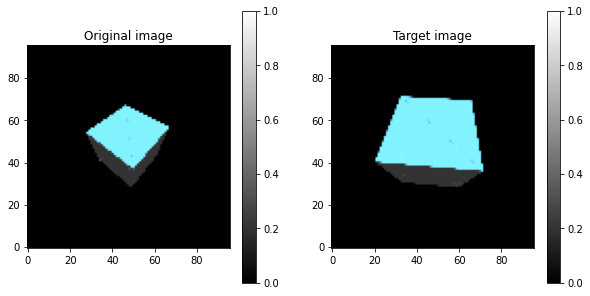
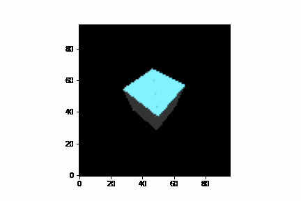
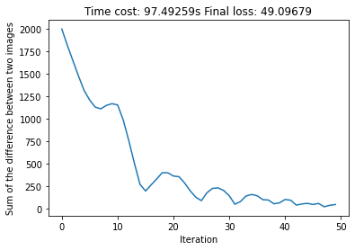

# Differentiable-rendering-with-JAX

## Optimizing vertex positions (blurriness scale = $10^{-1.5}$)

| Original and target image |  Optimization |  Loss history |
:-------------------------:|:-------------------------:|:-------------------------:
  |    |  
  |    |  

## Optimizing camera position (blurriness scale = $10^{-3}$)

| Original and target image |  Optimization |  Loss history |
:-------------------------:|:-------------------------:|:-------------------------:
  |    |  