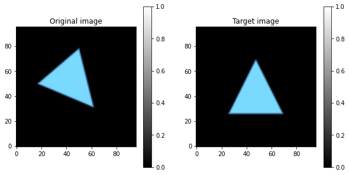
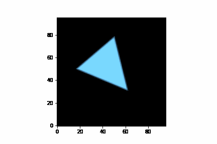
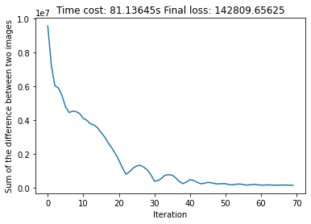

# Differentiable-rendering-with-JAX

## Optimizating vertex positions

| Original and target image |  Optimization |  Loss history |
:-------------------------:|:-------------------------:|:-------------------------:
  |    |  
  |    |  