# Differentiable-Rasterizer-with-JAX

(A new and more efficient implementation is provided here https://github.com/Theo-Wu/MetaRas-Jax)

## Optimize material

| Original and target image |  Optimization |  Loss history |
:-------------------------:|:-------------------------:|:-------------------------:
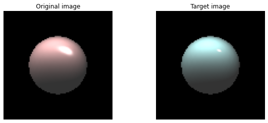  |  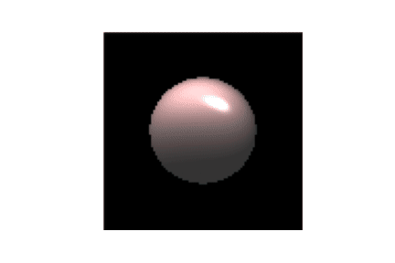  |  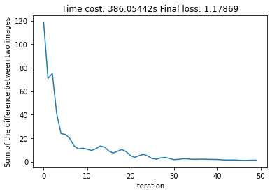

## Optimize lighting

| Original and target image |  Optimization |  Loss history |
:-------------------------:|:-------------------------:|:-------------------------:
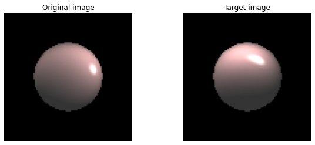  |  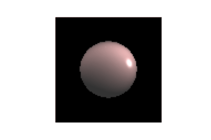  |  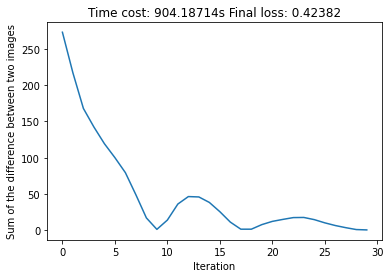

## Optimize vertex positions

| Original and target image |  Optimization |  Loss history |
:-------------------------:|:-------------------------:|:-------------------------:
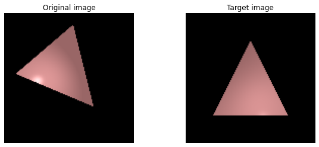  |  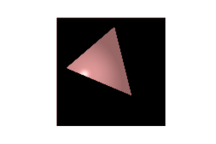  |  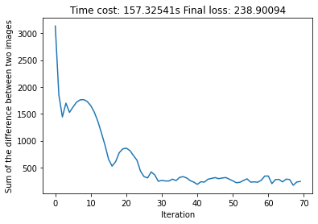
<!-- 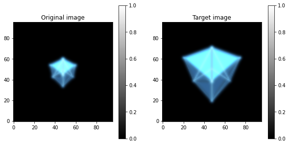  |  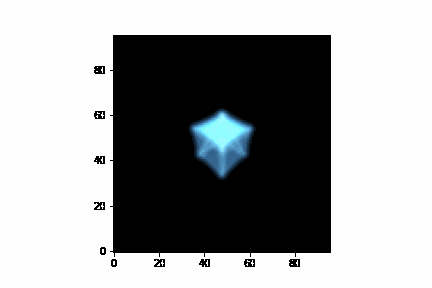  |  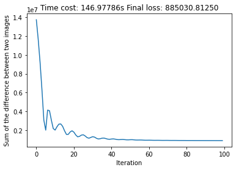 -->

## Optimize camera position

| Original and target image |  Optimization |  Loss history |
:-------------------------:|:-------------------------:|:-------------------------:
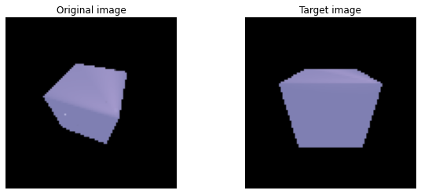  |  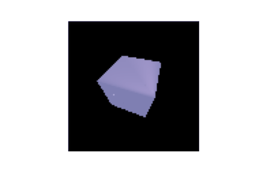  |  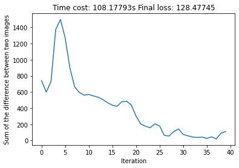

