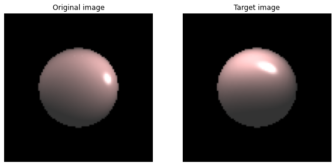
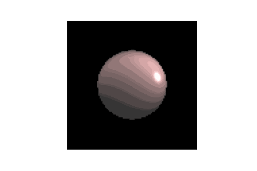
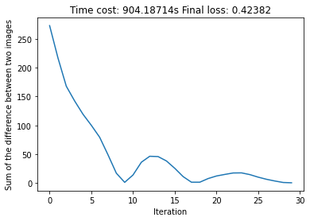

# Differentiable-rendering-with-JAX

## Optimize vertex positions

| Original and target image |  Optimization |  Loss history |
:-------------------------:|:-------------------------:|:-------------------------:
  |    |  
  |    |  

## Optimize camera position

| Original and target image |  Optimization |  Loss history |
:-------------------------:|:-------------------------:|:-------------------------:
  |    |  

## Optimize lighting
| Original and target image |  Optimization |  Loss history |
:-------------------------:|:-------------------------:|:-------------------------:
  |    |  
